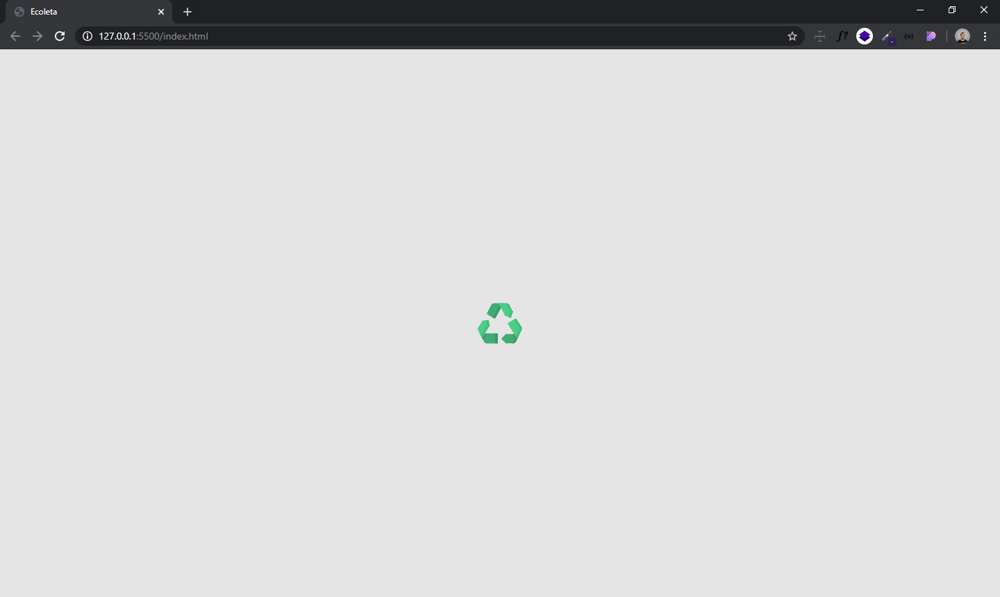
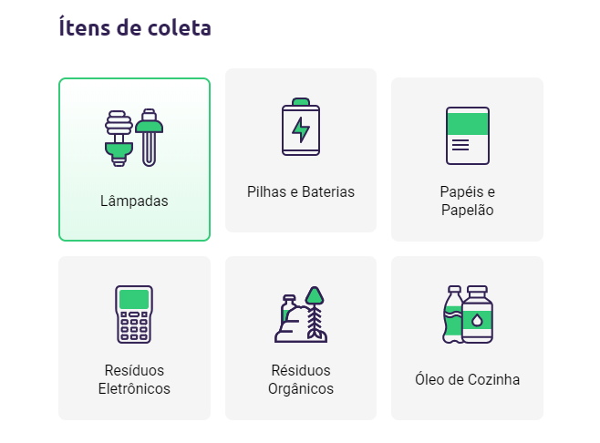

<h1 align="center">
    
    <br>
    

</h1>

<h4 align="center">
  Help people find collection points for recycling.
</h4>
<p align="center">
  
  
  
  
  
  <a href="https://github.com/lpaulovt/ecoleta-nlw-rocketseat/commits/master">
    
  </a>
  
  <a href="https://github.com/lpaulovt/ecoleta-nlw-rocketseat/issues">
    
  </a>
</p>

<p align="center">
  <a href="#rocket-technologies">Technologies</a>&nbsp;&nbsp;&nbsp; |&nbsp;&nbsp;&nbsp;
  <a href="#information_source-how-to-use">How To Use</a>&nbsp;&nbsp;&nbsp; |&nbsp;&nbsp;&nbsp;
  <a href="#beyond-the-proposed-project">Beyond the proposed project</a>
</p>


## :rocket: Technologies

This project was developed at the [RocketSeat Next Level Week](https://nextlevelweek.com/inscricao/1) with the following technologies:

-  [HTML]()
-  [CSS]()
-  [JavaScript]()
-  [jQuery](https://jquery.com/)

##  Beyond the proposed project

- Added loading page (jQuery)



- Added button animations (scale() and translateX())

- Added Collect item hover animation (translateY())



## :information_source: How To Use

To clone and run this application, you'll need [Git](https://git-scm.com) and [Node.js v10.16][nodejs] or higher. From your command line:

```bash
# Clone this repository
$ git clone https://github.com/lpaulovt/ecoleta-nlw-rocketseat

# Go into the repository
$ cd ecoleta-nlw-rocketseat

# Install dependencies
$ npm i

# Run the app
$ npm start
```
---

Made with ❤ by Paulo Lopes :wave: [Get in touch!](https://www.linkedin.com/in/lpaulovt)

[nodejs]: https://nodejs.org/